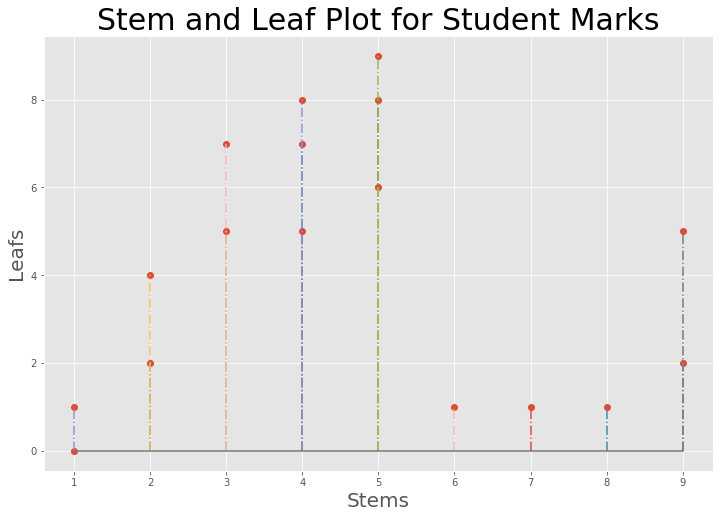
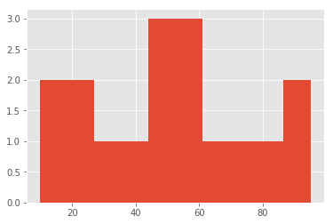

# Statistical Distributions with Stem and Leaf Plots - Lab

## Introduction

In this lab, you'll practice your stem and leaf plots knowledge.

## Objectives

You will be able to:

* Create stem and leaf plots from given data in matplotlib
* Compare effectiveness of stem plots as compared to histograms

## Analyzing Students Results

Below is list of marks (out of 100) that students obtained in a certain project. You can clearly see that there is a huge spread in the data reflecting a range of numbers going from 10 to 95. 

```
10,11,22,24,35,37,45,47,48,58,56,59,61,71,81,92,95
```


We would like to give grades to these students using a very naive criteria:
* Anything below 30 is a Fail
* 30 - 50 is a Referral for repeating the project
* 5 - 59 is a Pass
* 60 - 69 is a Merit
* 70 - 79 is a Distinction
* 80+ is a high distinction

Once the criteria is established, we would like to see how many students fall in each of these classes/grades using a visual approach.

We shall go ahead and build a stem and leaf plot for this data. This plot would help us visualize above grading classes and how many students fall in each class.

## Let's get started 
First lets import necessary libraries. We would need numpy for processing data and matplotlib for visualizations. 


```python
import matplotlib.pyplot as plt
import numpy as np
plt.style.use('ggplot')
```

First we need to make a numpy array containing all of those above values.


```python
marks = np.array([10, 11, 22, 24, 35, 37, 45, 47, 48, 58, 56, 59, 61, 71, 81, 92, 95])
marks
```


    array([10, 11, 22, 24, 35, 37, 45, 47, 48, 58, 56, 59, 61, 71, 81, 92, 95])


##  The `pyplot.stem()`  method

the pyplot module in matplotlib comes packaged with a `.stem()` method for visualizing stem and leaf plots. Heres a general syntax for calling this method
```python
plt.stem(x=stems, y=leaves, linefmt, markerfmt, basefmt)
```
And [here is the official documentation](https://matplotlib.org/api/_as_gen/matplotlib.pyplot.stem.html) if you want to dig deeper for customizations. We shall simply pass the stem(grades) and leaves(marks) arrays to this function with some simple formatting to visualize the plot.

As you can see, in order to plot the stem and leaf plot, we will need to first seperate our data into stems and leafs.
To do this, write a function or use a loop to seperate eachdata point into tens and ones digits. For example, 65 would get split into stem: 6 (the tens digit) and leaf: 5 (the ones digit). Preferably, use numerical methods on the integers themselves as opposed to converting the number to a string and using slicing.


```python
# Create stems and leafs arrays to store the grades for all the marks in marks array, in the same order.
stems = []
leafs = []

for mark in marks:
    stem = mark //10
    leaf = mark %10
    stems.append(stem)
    leafs.append(leaf)
```

Great! Now that you have your stems and leafs defined, use the `pyplot.stem()` method to created a stem and leaf plot!   
Be sure to style your plot including:

* Use a figure size of 12 x 8
* Set suitable limits for x and y - axis 
* Apply label and axes formatting 


```python
# Create a stem and leaf plot including the above styling
plt.figure(figsize=(12,8))
# markerline, stemlines, baseline = 

plt.stem(stems, leafs, '-.', 'o' )
plt.title('Stem and Leaf Plot for Student Marks', fontsize = 30 )
plt.ylabel('Leafs', fontsize = 20)
plt.xlabel('Stems', fontsize = 20)

plt.show()
```





## Analyzing the output
So there we have it, our stem and leaf plot. While all the underlying data is retrievable, the plot can be a little bizarre to decipher. The number of points shows how many data points are in each bucket. The x-axis, or stems, represent the tens digit of each datapoint. So we can see that since most points have a stem of 5 or below, most students scored in the 50s or lower on this exam.

Just to get a bit more intuition behind this, let's build a histogram and compare both plots.


```python
# Create a histogram for marks
plt.hist(marks)
```


    (array([2., 2., 1., 1., 3., 3., 1., 1., 1., 2.]),
     array([10. , 18.5, 27. , 35.5, 44. , 52.5, 61. , 69.5, 78. , 86.5, 95. ]),
     <a list of 10 Patch objects>)





While we can't retrieve the original data points, it is easier to visualize where the data lies. As we saw before, we can get an idea about the placement frequency  of marks in a certain class/grade, but theres no way to see individual values. For an indepth analysis, it is highly recommended to use the appropriate plotting style to have a clear understanding of underlying data. 

## Summary

In this lab, we saw how to create stem and leaf plot using matplotlib. We also re-enforced the idea that these plots could be more insightful than histograms in some cases. In the upcoming labs, we shall talk about other statistical visualizations to dive deeper into the distributions.
